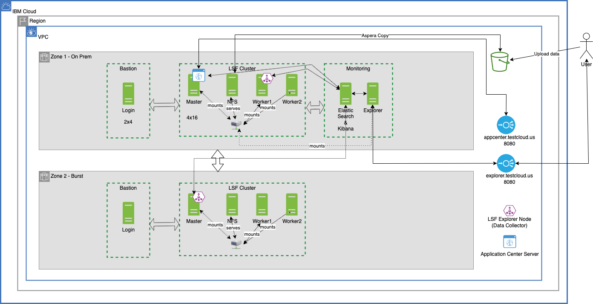
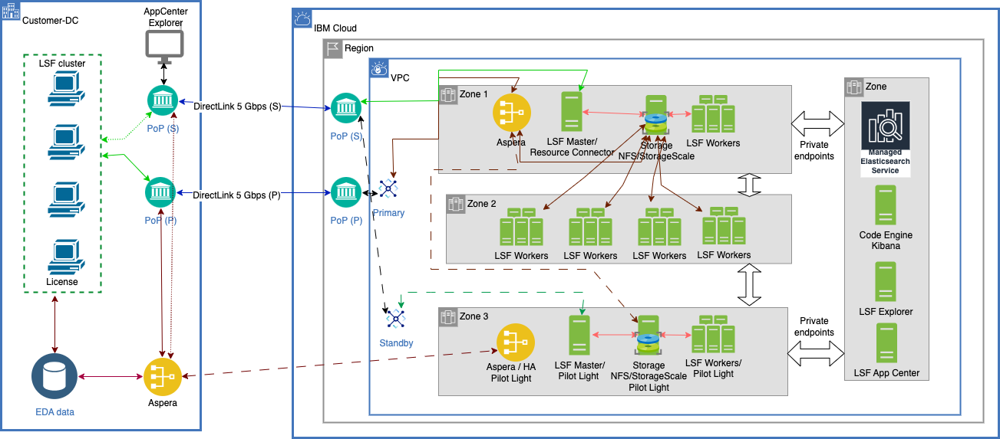

# Tech Zone LSF HPC Demo

## Overview

For customer demos or internal enablement workshops, users need to emulate a hybrid cloud with an on-premises cluster (simulated) and a burst cluster in IBM Cloud. Customers would like to see how they would use the LSF cluster on IBM Cloud as an extension to their on-prem infrastructure. This demo asset includes the automatic creation of both clusters, each cluster in a zone of a multi-zone region, applying integrations to connect the clusters, enabling the LSF Application Center such that users can interact with LSF clusters in deploying workloads, exploring the features of LSF instead of undifferentiated heavy lifting of building and operating the clusters. 

## Architecture

The TechZone LSF on IBM Cloud **demo architecture** is shown below. You can reserve this demo in TechZone. If you want to deploy this into your own account, read the rest of this document.



Typical Architecture for **customer use **cases is shown below.



### Typical customer use case pattern

Customer invested into a homegrown HPC cluster in their data centers with off-the-shelf hardware or custom hardware and custom networking. Due to business demands, due to the technological advancements in cloud computing, customers would no longer wish to invest in capital expenditure. They want to expand their on-prem cluster into the Public Cloud as an extension or burst capacity if their on-prem cluster is fully utilized. 

### Demo architecture

1. The on-prem simulated cluster consists of 1 management host and 1 static worker node. Usually, customers running LSF on-prem would have 1 or more static management hosts and a few or hundreds of static worker nodes. In the demo cluster, we are simulating the static nature of the on-prem cluster.

2. The burst cluster consists of 1 management host and 0-3 dynamic worker nodes. The burst management node and on-prem management node are connected over the intra-zone IBM Cloud backbone. In a production use case, this network would be over DirectLink between on-prem and IBM Cloud. The 3 dynamic worker nodes are only created when there is enough demand for resources and when the on-prem nodes are fully utilized. 

## Prerequisites

**NOTE:  If you are deploying via TechZone, the following is not required. Follow these steps only if you want to deploy this exact environment into your own IBM Cloud account for a PoC or a customized demo.**

1. Fork this repo https://github.com/sam-andaluri/tz-hpc-cluster-lsf . Create a GitHub API key in the github.ibm.com account.

2. The TechZone Demo environment requires 3 JSON files to pass parameters. See below for the structure and format of these. You would need to prepare them first before running deployment commands. The `on-prem-params.json` and `burst-params.json` are already present in the repo in the folder `deployment`. The `secrets.json` file consists of the IBM Cloud API key, GitHub API key, and IBM Customer Number (for entitlement checks). If you deploy using TechZone, you don't need any of these as they are included in the deployment. Hence it is recommended to use TechZone where possible.

#### **`on-prem-params.json`**
```
{
    "name": "TechZone OnPrem LSF cluster",
    "location": "us-south",
    "repo" : "https://github.ibm.com/andaluri/techzone-lsf-v2.1.0/tree/main",
    "cluster_name" : "OnPremCluster",
    "cluster_prefix" : "on-prem",
    "zone": "us-south-1",
    "ssh_key_name" : "lsf-on-prem",
    "vpc_name": "tz-test-1",
    "resource_group" : "tz-test",
    "enable_app_center": "true",
    "hyperthreading_enabled" : "false",
    "management_node_count": "1",
    "worker_node_min_count" : "1",
    "worker_node_max_count" : "1",
    "volume_capacity" : "300",
    "volume_iops" : "3000"
}
```

#### **`burst-params.json`**
```
{
    "name": "TechZone OnPrem LSF cluster",
    "location": "us-south",
    "repo" : "https://github.ibm.com/andaluri/techzone-lsf-v2.1.0/tree/main",
    "cluster_name" : "BurstCluster",
    "cluster_prefix" : "burst",
    "zone": "us-south-1",
    "ssh_key_name" : "lsf-on-prem",
    "vpc_name": "tz-test-1",
    "resource_group" : "tz-test",
    "enable_app_center": "true",
    "hyperthreading_enabled" : "false",
    "management_node_count": "1",
    "worker_node_min_count" : "1",
    "worker_node_max_count" : "1",
    "volume_capacity" : "300",
    "volume_iops" : "3000"
}
```

#### **`secrets.json`**
```
{
    "name": "LSF",
    "api_key": "API_KEY",
    "github" : "GITHUB_KEY",
    "ibm_customer_number" : "IBM_CUSTOMER_NUMBER",
    "app_center_gui_pwd": "Passw@rd56",
    "app_center_db_pwd": "Passw@rd78",
    "remote_allowed_ips" : "[\"WAN_IP\"]",
    "scale_compute_cluster_gui_username": "admin",
    "scale_compute_cluster_gui_password": "Passw@rd12",
    "scale_storage_cluster_gui_username": "admin",
    "scale_storage_cluster_gui_password": "Passw@rd34",
    "resource_group": "tz-test",
    "cis_crn": "CIS_CRN",
    "cis_domain_id": "CIS_DOMAIN_ID"
}
```

3. Review the `Makefile` which executes a series of shell scripts that perform various tasks. In the order of operation, cleans any temporary files created, creates a VPC, creates and uploads SSH keys, creates on-prem cluster, creates burst cluster, creates security groups that allow traffic from two clusters, creates SSH config, creates ansible inventory finally integrates the two clusters using an ansible playbook. Use `make create` and `make delete` to create the entire stack or destroy clusters (leaving the VPC and SSH keys intact) for later re-deployment.

Check the outputs section for the URL for the Application Center. Log in to App Center with `lsfadmin` and password as defined in the `secrets.json`.

## Steps to validate the cluster post-provisioning

Login to the management-host node using the ssh command
* Check the existing machines part of the cluster using ```$bhosts``` or ```$bhosts -w``` command, this should show all instances.
* Submit a job that would spin 1 VM and sleep for 10 seconds ```$bsub -n 1 sleep 10```,once submitted command line will show a jobID.
* Check the status for job using ```$bjobs -l <jobID>```
* Check the log file under ```/opt/ibm/lsf/log/ibmcloudgen2``` for any messages around provisioning of the new machine
* Continue to check the status of nodes using ```lshosts``` ```bjobs``` ```bhosts``` commands
* To test multiple VMs you can run multiple sleep jobs -> $bsub -n 10 sleep 10 -> This will create 10 VMs and each job will sleep for 10 seconds

## Storage Node and NFS Setup
The storage node is configured as an NFS server and the data volume is mounted to the /data directory which is exported to share with LSF cluster nodes.

### Steps to validate NFS Storage node 

##### 1. To validate that the NFS storage is set and exported correctly

Log in to the storage node using SSH (ssh -F ./ssh-config-generated -J on-prem-login on-prem-management-host-0)

* The below command shows that the data volume, /dev/vdd, is mounted to /data on the storage node.
```
# df -k | grep data
/dev/vdd       104806400 1828916 102977484   2% /data`
```
* The command below shows that /data is exported as a NFS shared directory.

```
# exportfs -v
/data         	10.242.66.0/23(sync,wdelay,hide,no_subtree_check,sec=sys,rw,secure,no_root_squash,no_all_squash)
```

* At the NFS client end, the LSF cluster nodes in this case, we mount the /data directory in NFS server to the local directory, /mnt/data.
```
# df -k | grep data
10.242.66.4:/data 104806400  1828864 102977536   2% /mnt/data
```
The command above shows that the local directory, /mnt/data, is mounted to the remote /data directory on the NFS server, 10.242.66.4.

For ease of use, we create a soft link, /home/lsfadmin/shared, pointed to /mnt/data. The data that needs to be shared across the cluster can be placed in /home/lsfadmin/shared.
```
/home/lsfadmin>ls -l
total 0
lrwxrwxrwx. 1 root root 9 May 27 14:52 shared -> /mnt/data
```

### 2. Steps to validate whether the clients can write to the NFS storage

* Login to the management host as shown in the ssh_command output
```
$ ssh -F ./ssh-config-generated -J on-prem-login on-prem-management-host-0
```
* Submit a job to write the hostname to the /home/lsfadmin/shared directory on the NFS server
```
$ bsub sh -c 'echo $HOSTNAME > /home/lsfadmin/shared/hello.txt'
```
* Wait until the job is finished and then run the command to confirm the hostname is written to the file on the NFS share
```
$ bjobs
$ cat /home/lsfadmin/shared/hello.txt
ibm-gen2host-10-241-0-21  # worker hostname
```

### 3. steps to validate spectrum scale integration

* Login to scale storage node using SSH. (`ssh -J root@52.116.122.64 root@10.240.128.37`, 
  details will be available in the logs output with key `spectrum_scale_storage_ssh_command`)
* The below command shows the gpfs cluster setup on scale storage node.
```buildoutcfg
# /usr/lpp/mmfs/bin/mmlscluster
```
* The below command shows file system mounted on number of nodes
```buildoutcfg
# /usr/lpp/mmfs/bin/mmlsmount all
```
* The below command shows the fileserver details. This command can be used to validate file block size(Inode size in bytes).
```buildoutcfg
#   /usr/lpp/mmfs/bin/mmlsfs all -i
```
* Login to management-host node using SSH. (ssh -J root@52.116.122.64 root@10.240.128.41)
* The below command shows the gpfs cluster setup on computes node. This should contain the management-host,management-host-candidate, and worker nodes.
```buildoutcfg
# /usr/lpp/mmfs/bin/mmlscluster
```
* Create a file on mountpoint path(e.g `/gpfs/fs1`) and verify on other nodes that the file can be accessed.

##### 4. steps to access the Scale cluster GUI

* Open a new command line terminal.
* Run the following command to access the storage cluster:

```buildoutcfg
#ssh -L 22443:localhost:443 -J root@{FLOATING_IP_ADDRESS} root@{STORAGE_NODE_IP_ADDRESS}
```
* where STORAGE_NODE_IP_ADDRESS needs to be replaced with the storage IP address associated with {cluster_prefix}-scale-storage-0, which you gathered earlier, and FLOATING_IP_ADDRESS needs to be replaced with the floating IP address that you identified.

* Open a browser on the local machine, and run https://localhost:22443. You will get an SSL self-assigned certificate warning with your browser the first time that you access this URL.

* Enter the login credentials that you set up when you created your workspace to access the Spectrum Scale GUI.
Accessing the compute cluster

* Open a new command line terminal.
* Run the following command to access the compute cluster:

```buildoutcfg
 #ssh -L 21443:localhost:443 -J root@{FLOATING_IP_ADDRESS} root@{COMPUTE_NODE_IP_ADDRESS}
 ```
* where COMPUTE_NODE_IP_ADDRESS needs to be replaced with the storage IP address associated with {cluster_prefix}-primary-0, which you gathered earlier, and FLOATING_IP_ADDRESS needs to be replaced with the floating IP address that you identified.

* Open a browser on the local machine, and run https://localhost:21443. You will get an SSL self-assigned certificate warning with your browser the first time that you access this URL.

* Enter the login credentials that you set up when you created your workspace to access the Spectrum Scale GUI.

##### Steps to access the Application Center GUI/Dashboard.

* Open a new command line terminal.
* Run the following command to access the Application Center GUI:

```buildoutcfg
#ssh -L 8080:localhost:8080 -J root@{FLOATING_IP_ADDRESS} root@{MANGEMENT_NODE_IP_ADDRESS}
```
* where MANGEMENT_NODE_IP_ADDRESS needs to be replaced with the Management node IP address associated with {cluster_prefix}-management-host-0, which you gathered earlier, and FLOATING_IP_ADDRESS needs to be replaced with the floating IP address that you identified.

* Open a browser on the local machine, and run http://localhost:8080. 

* To access the Application Center GUI, enter the password you configured when you created your workspace and the default user as "lsfadmin".

